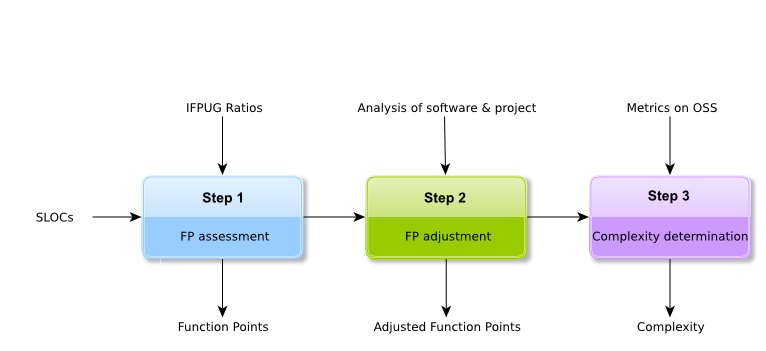

# The FLOSC Method

The method we propose to determine the software complexity is based on the generally accepted IFPUG method. However, it appeared to us that it is relevant to adapt this method to the context of the free and open source software.

Indeed, the IFPUG method propose to evaluate the complexity of applications during the early stages of the projects (Specifications/Design) while focusing on business aspects regardless of the technical aspects. Hence, we propose the following adaptations:

* assessment of the number of function points of the free and open source software from the number of lines of codes, being based on fine grained metrics coming from the observations by Atos and the IT industry.

* use of adjustment factors different from the IFPUG's but within the same framework.

The general approach is composed of three steps, described throughout the rest of the document.

