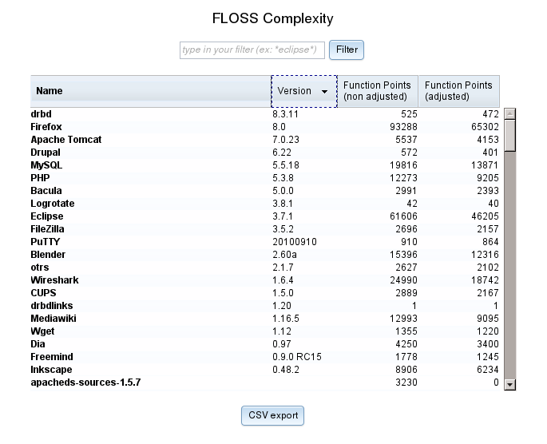
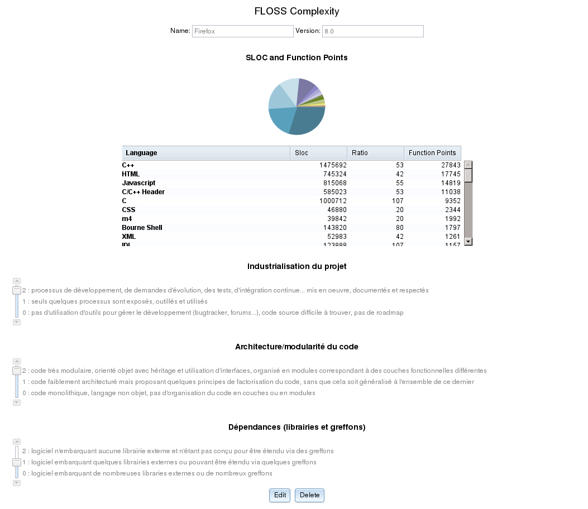

# Tools

## Number of SLOC calculation

As described previously, FLOSC is based on the free tool cloc^[<http://cloc.sourceforge.net>] to count the number of SLOC of an open source component.

## Function points adjustment

The FLOSC project develops and maintain a web application dedicated to the entry and the visualization of the function points adjustments.

