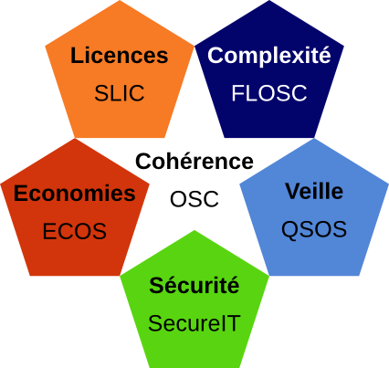

# Annexe B : framework Drakkr

FLOSC est un sous-projet de l'initiative Drakkr visant à construire un framework libre dédié la gouvernance open source au sein des entreprises et administrations.

Outre FLOSC, lié à l'évaluation de la complexité des logiciels libres et open source, Drakkr propose également d'autres méthodes et outils pour mettre en oeuvre une telle gouvernance.

* __OSC__ (Open Source Cartouche) : sous-projet dédié à l'identification unique d'une version d'un logiciel open source ainsi qu'à la gestion des ses metadonnées ;

* __ECOS__ (Evaluation des Coûts liés à l'adoption de logciels Open Source) : sous-projet relatif à l'évaluation et au calcul du coût total de prossession d'un logiciel open source ainsi qu'au retour sur investissement d'une migration ;

* __QSOS__ (Qualification et Sélection de logiciels Open Source) : sous-projet proposant une méthode et des outils pour qualifier, sélectionner et comparer les logiciels open source et ainsi industrialiser et mutualiser une démarche de veille ;

* __SLIC__ (Software LIcense Comparator) : sous-projet dédié à la description formelle des licences open source et de leurs compatibilités respectives ;

* __SecureIT__ : sous-projet dédié à la gestion des alertes de sécurité dans les logiciels open source.

Consultez le site Web du projet Drakkr pour plus de détails : <http://www.drakkr.org>.
