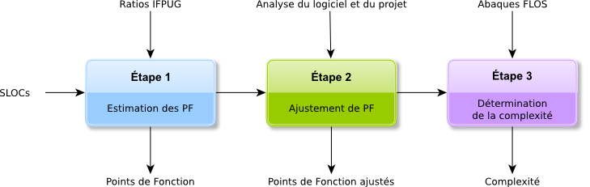

# La méthode FLOSC

La méthode que nous proposons d'utiliser pour déterminer la complexité des logiciels se base sur la méthode reconnue IFPUG. Il nous a cependant semblé pertinent de l'adapter au contexte des logiciels libres et open source.

En effet, la méthode IFPUG propose d'évaluer la complexité des applications dans les phases amont des projets (spécification/conception) en se concentrant sur les aspects métiers sans se soucier des aspects techniques d'implémentation. Ainsi, nous proposons les adaptations suivantes :

* estimation du nombre de Points de Fonction des logiciels libres et open source à partir de nombre de lignes de codes en se basant sur des métriques fines issues de l'observation par Atos et l'industrie informatique en général ;

* utilisation de facteurs d'ajustement différents de ceux proposés par IFPUG mais s'inscrivant dans la logique proposée par cette méthode.

La démarche générale d'évaluation peut ainsi être décomposée en trois étapes, décrites dans la suite du présent document.

