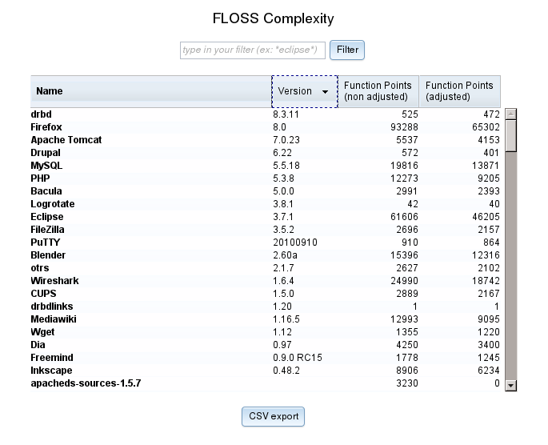
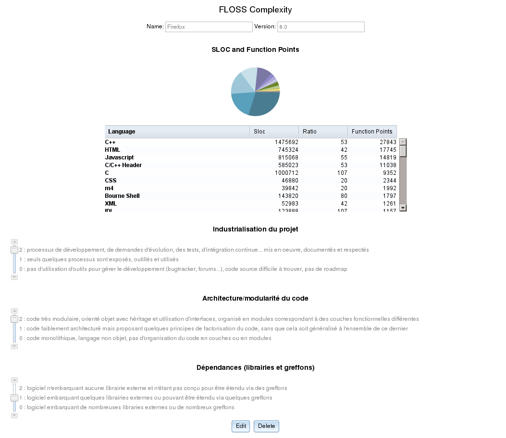

# Outils

## Calcul du nombre de SLOC

Comme précédemment évoqué, FLOSC se base sur l'outil libre cloc^[<http://cloc.sourceforge.net>] pour compter le nombre de SLOC d'un composant open source.

## Ajustement des Points de Fonction

Le projet FLOSC développe et maintient un application Web dédiée à la saisie et à la visualisation des ajustements des Points de Fonction. 

